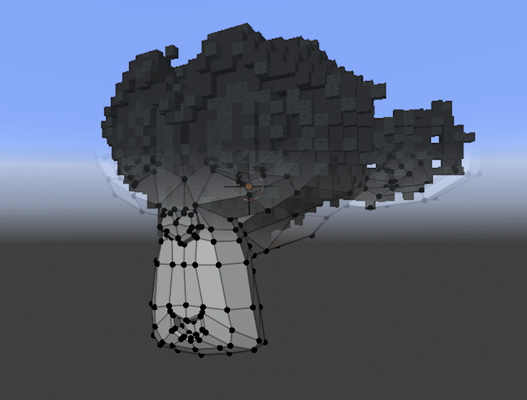

# mcpp media generation

[mcpp](https://github.com/rozukke/mcpp) is a library for interfacing with Minecraft using C++.

Here are some short scripts I wrote while messing around with it.

These instructions are written for MacOS, and may differ for other platforms.

### Compiling

First install mcpp from the steps linked above. Then run `g++ -std=c++17 -Wall -o FILENAME FILENAME.cpp -lmcpp` replacing FILENAME with the path for the .cpp file to compile.

## Videos

`video-mc.cpp`

### Usage

Using ffmpeg, convert an mp4 to a rgb file. To do so run `ffmpeg -i filename.mp4 -f rawvideo -pix_fmt rgb24 filename.rgb`

Run `./video-mc filename.rgb width height scale frame_rate`

> Scale is used to divide the image size

### Examples

> .rgb not included

`./video-mc examples/rick-roll.rgb 640 480 16 24`

`./video-mc examples/bad-apple.rgb 320 240 5 30`

## Models

`obj-mc.cpp`

### Usage

Using blender or any other 3d modeling software, convert your model to a .obj file.

Run `./obj-mc filename.obj scale`

> Scale is the max size of any dimension

### Examples

> .obj not included

`./obj-mc examples/blender-monkey.obj 50`

